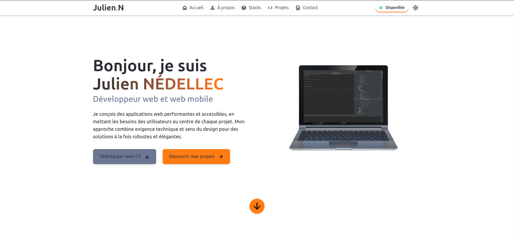

# Portfolio de Julien NÉDELLEC


## Pourquoi ce portfolio ?

J'ai créé ce portfolio pour présenter mon parcours, mes compétences et mes projets en tant que développeur web et web mobile. Passionné par le code propre et durable, je considère chaque ligne comme une brique d'un ensemble cohérent, lisible et maintenable.

Mon approche repose sur une architecture modulaire, pensée pour évoluer avec les équipes et les besoins techniques. Je conçois des interfaces claires, accessibles et centrées sur l'utilisateur, pour répondre à de vrais besoins avec sens et efficacité.

Ce qui me motive, c'est d'écrire un code clair, structuré et testé, capable d'évoluer sereinement face aux besoins concrets. Je conçois des solutions simples, robustes et durables, en restant à l'écoute des usages pour offrir une expérience fluide et pertinente.

## Technologies utilisées

Ce portfolio a été développé avec les technologies suivantes :
- Angular 19
- TypeScript
- TailwindCSS
- RxJS
- EmailJS pour le formulaire de contact

## Fonctionnalités

- Design responsive adapté à tous les appareils
- Mode sombre/clair
- Formulaire de contact fonctionnel
- Optimisation des images pour de meilleures performances
- Architecture modulaire et maintenable

## Serveur de développement

Pour démarrer un serveur de développement local, exécutez :

```bash
ng serve
```

Une fois le serveur démarré, ouvrez votre navigateur et accédez à `http://localhost:4200/`. L'application se rechargera automatiquement si vous modifiez l'un des fichiers source.

## Construction

Pour construire le projet, exécutez :

```bash
ng build
```

Cela compilera votre projet et stockera les artefacts de construction dans le répertoire `dist/`. Par défaut, la construction de production optimise votre application pour les performances et la vitesse.

## Tests unitaires

Pour exécuter les tests unitaires avec Vitest, utilisez la commande suivante :

```bash
pnpm run test
```

## Configuration du formulaire de contact

Cette application utilise [EmailJS](https://www.emailjs.com/) pour envoyer des emails depuis le formulaire de contact. Pour configurer EmailJS pour votre propre usage :

1. Créez un compte sur [EmailJS](https://www.emailjs.com/)
2. Créez un nouveau service Email dans votre tableau de bord EmailJS
3. Créez un nouveau modèle d'email dans votre tableau de bord EmailJS
4. Mettez à jour les valeurs de configuration suivantes dans l'application :

### Dans `src/app/app.component.ts` :
```typescript
// Initialiser EmailJS avec votre clé publique
emailjs.init('VOTRE_CLE_PUBLIQUE_DU_TABLEAU_DE_BORD_EMAILJS');
```

### Dans `src/app/features/public/contact/service/contact.service.ts` :
```typescript
// Configuration EmailJS
const emailjsServiceId = 'VOTRE_ID_DE_SERVICE_DU_TABLEAU_DE_BORD_EMAILJS';
const emailjsTemplateId = 'VOTRE_ID_DE_MODELE_DU_TABLEAU_DE_BORD_EMAILJS';
```

## Chargement des données

Cette application charge les données directement à partir d'un fichier JSON situé dans le répertoire `public/` à la racine du projet. Les données sont chargées à l'aide du HttpClient d'Angular et sont disponibles dans toute l'application.

La structure des données est définie dans le fichier `public/db.json`, qui contient des sections pour différentes parties de l'application (hero, about, projects, stacks, etc.).

Aucun serveur supplémentaire n'est nécessaire pour exécuter l'application, car les données sont chargées directement à partir du fichier.

## Optimisation des images

Cette application utilise la directive NgOptimizedImage d'Angular pour optimiser le chargement et le rendu des images. L'application charge automatiquement des images de taille appropriée en fonction de la largeur du viewport, ce qui améliore les performances et réduit la consommation de données mobiles.

### Fonctionnalités d'optimisation d'images

La directive NgOptimizedImage d'Angular offre plusieurs fonctionnalités puissantes :
- Génération automatique d'attributs `srcset` pour les images responsives
- Chargement différé (lazy loading) des images non prioritaires
- Priorité de chargement pour les images importantes (LCP)
- Configuration des points d'arrêt pour les différentes tailles d'images

### Configuration du chargeur d'images

L'application utilise un chargeur d'images personnalisé pour générer les URL des images optimisées. Ce chargeur est configuré dans le fichier `app.config.ts` :

```typescript
// Chargeur d'images personnalisé pour les images locales
const localImageLoader = (config: ImageLoaderConfig) => {
  // Extrait le chemin de base et l'extension
  const path = config.src;
  const lastDotIndex = path.lastIndexOf('.');
  if (lastDotIndex === -1) return path;

  const basePath = path.substring(0, lastDotIndex);
  const extension = path.substring(lastDotIndex + 1);

  // Si une largeur est fournie, génère une URL pour l'image redimensionnée
  if (config.width) {
    return `${basePath}-${config.width}.${extension}`;
  }

  // Sinon, retourne l'URL de l'image originale
  return path;
};

// Configuration des points d'arrêt pour la génération de srcset
{
  provide: IMAGE_CONFIG,
  useValue: {
    breakpoints: [
      // Images de projet
      480, 768, 1024, 1280, 1920,
      // Image de portrait
      288, 384, 576, 768,
      // Icônes de technologie
      48, 64, 96, 128
    ]
  }
}
```

### Génération d'images optimisées

Pour générer des versions optimisées des images du portfolio, consultez le [Guide d'optimisation des images](public/images/README.md) qui fournit des instructions détaillées sur la façon de créer des images optimisées à l'aide de Sharp (Node.js) ou d'ImageMagick (ligne de commande).

### Structure des images optimisées

Pour chaque type d'image, plusieurs tailles sont générées :

#### Images de projet
- Taille originale (ex: `arcadia.webp`)
- Version 1920px de large (ex: `arcadia-1920.webp`)
- Version 1280px de large (ex: `arcadia-1280.webp`)
- Version 1024px de large (ex: `arcadia-1024.webp`)
- Version 768px de large (ex: `arcadia-768.webp`)
- Version 480px de large (ex: `arcadia-480.webp`)

#### Image de portrait
- Taille originale (ex: `julien.webp`)
- Version 768px de large (ex: `julien-768.webp`)
- Version 576px de large (ex: `julien-576.webp`)
- Version 384px de large (ex: `julien-384.webp`)
- Version 288px de large (ex: `julien-288.webp`)

#### Icônes de technologie
- Taille originale (ex: `angular.webp`)
- Version 128px de large (ex: `angular-128.webp`)
- Version 96px de large (ex: `angular-96.webp`)
- Version 64px de large (ex: `angular-64.webp`)
- Version 48px de large (ex: `angular-48.webp`)

Pour plus de détails sur le processus d'optimisation des images, consultez le [Guide d'optimisation des images](public/images/README.md).
